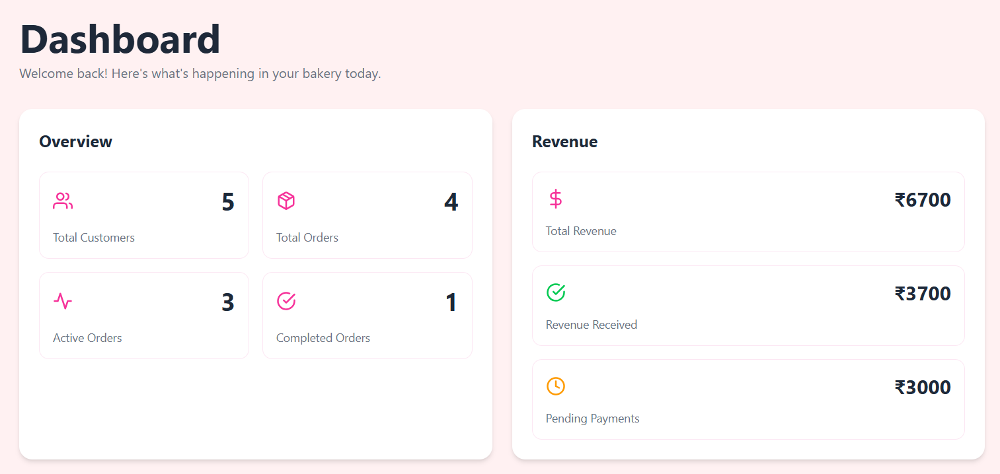
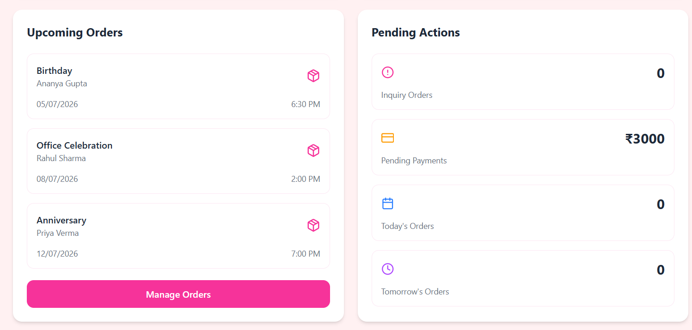
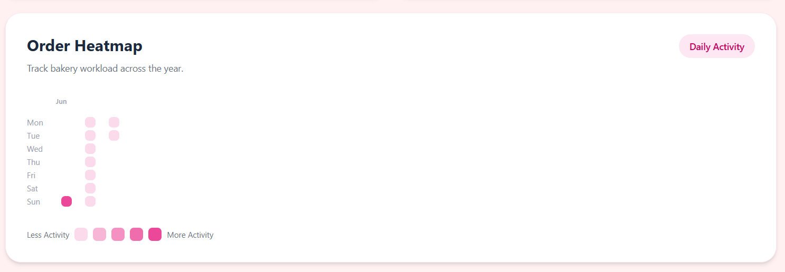
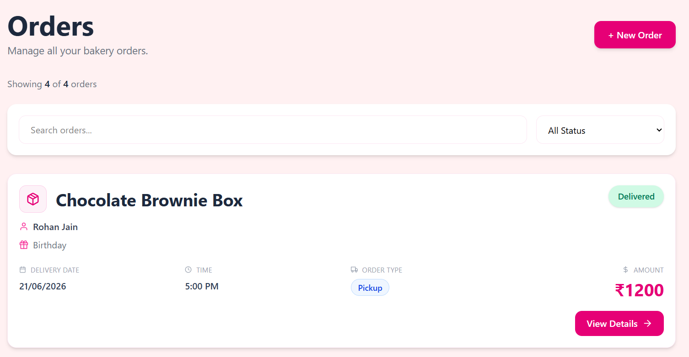
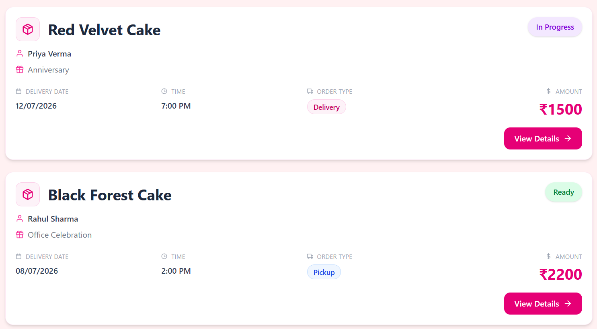
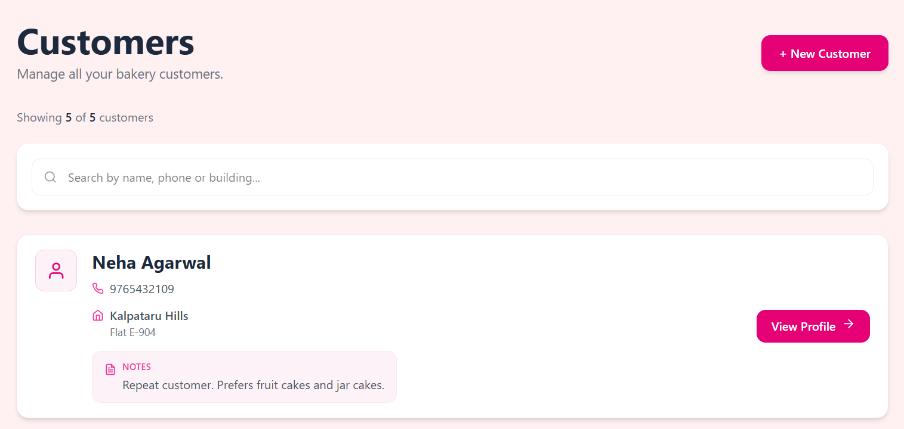
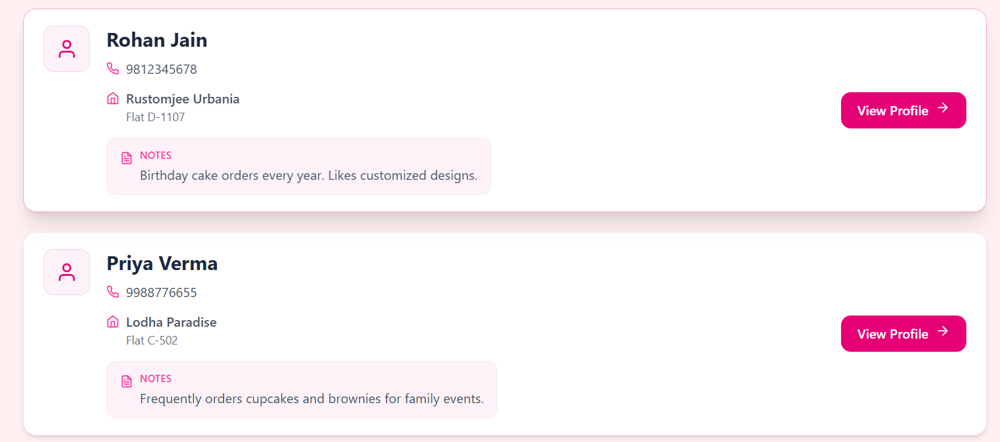
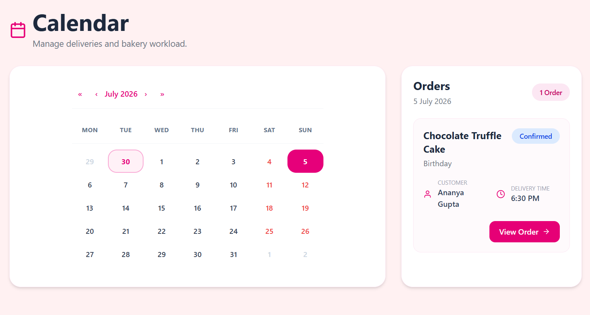

# 🍰 Bakers_at__Home

## 🚀 Overview

Bakers_at__Home is a full-stack **MERN Bakery Operations Platform** designed for home bakery owners to manage customers, orders, payments, deliveries, and daily workload from a single dashboard.

Instead of maintaining notebooks or spreadsheets, the platform provides an organized digital solution for tracking bakery operations in real time.




---

## 🌐 Live Demo

Explore the deployed application here:

🔗 **[Visit Bakers_at__Home](https://bakers-at-home-zeta.vercel.app/)**

---

# ✨ Features

## 📊 Dashboard

- Business overview
- Revenue summary
- Active & completed orders
- Upcoming deliveries
- Pending actions
- Order Heatmap

---

## 👥 Customer Management

- Add new customers
- View all customers
- Search customers
- Edit customer details
- Delete customers
- Customer profile with complete order history

---

## 📦 Order Management

- Create orders
- View order details
- Edit orders
- Delete orders
- Search orders
- Filter orders by status
- Update order status

---

## 📅 Calendar

- Monthly delivery calendar
- View orders scheduled for a selected date
- Easy workload planning

---

## 💰 Payment Tracking

- Total Revenue
- Revenue Received
- Pending Payments
- Advance Payment Tracking

---

# 🛠 Tech Stack

| Category | Technologies |
|----------|--------------|
| **Frontend** | React, Vite, Tailwind CSS, Axios, React Router DOM, React Icons |
| **Backend** | Node.js, Express.js |
| **Database** | MongoDB Atlas, Mongoose |
| **Deployment** | Vercel, Render |

---

# 📸 Screenshots

## 📊 Dashboard

### Business Overview


### Upcoming Orders & Pending Actions



---

## 🔥 Order Heatmap



---

## 📦 Orders

### Orders List



### More Orders



---

## 👥 Customers

### Customer List



### More Customers



---

## 📅 Calendar



---

# 📂 Project Structure

```text
Bakers_at__Home
│
├── backend
│   ├── config
│   ├── controllers
│   ├── middleware
│   ├── models
│   ├── routes
│   ├── server.js
│   └── package.json
│
├── frontend
│   ├── public
│   ├── src
│   │   ├── assets
│   │   ├── components
│   │   ├── pages
│   │   ├── services
│   │   ├── hooks
│   │   └── utils
│   └── package.json
│
├── screenshots
│   ├── dashboard1.png
│   ├── dashboard2.png
│   ├── heatmap.png
│   ├── orders1.png
│   ├── orders2.png
│   ├── customers1.png
│   ├── customers2.png
│   └── calendar.png
│
└── README.md
```

---

# 🚀 Getting Started

## Prerequisites

Before running this project, make sure you have installed:

- Node.js
- npm
- Git
- MongoDB Atlas account

---

## Clone the Repository

```bash
git clone https://github.com/mannatjain11465-netizen/Bakers_at__Home.git
```

Move into the project directory.

```bash
cd Bakers_at__Home
```

---

## Backend Setup

```bash
cd backend
npm install
npm start
```

The backend will start on:

```text
http://localhost:5000
```

---

## Frontend Setup

Open another terminal.

```bash
cd frontend
npm install
npm run dev
```

The frontend will start on:

```text
http://localhost:5173
```

---

# 🔑 Environment Variables

## Backend (.env)

```env
PORT=5000
MONGODB_URI=your_mongodb_connection_string
```

---

## Frontend (.env)

```env
VITE_API_URL=http://localhost:5000/api
```

---

# 🎯 Current Features

- ✅ Complete Customer CRUD Operations
- ✅ Complete Order CRUD Operations
- ✅ Customer Profile
- ✅ Dashboard Analytics
- ✅ Revenue Summary
- ✅ Payment Tracking
- ✅ Search Customers
- ✅ Search Orders
- ✅ Order Status Update
- ✅ Calendar View
- ✅ Order Heatmap
- ✅ REST APIs
- ✅ MongoDB Integration
- ✅ Responsive User Interface
- ✅ Cloud Deployment (Vercel + Render)

---

# 🚀 Future Improvements

- 🔐 Authentication & Authorization
- 👤 Multiple Owner Accounts
- 🛍 Product Management Module
- 📦 Inventory Management
- 🖼 Image Upload Support
- 📧 Email Notifications
- 💬 WhatsApp Order Reminders
- 💳 Payment Gateway Integration
- 🧾 Invoice Generation (PDF)
- 📈 Advanced Sales Analytics Dashboard
- 📤 Export Orders to Excel
- 📱 Improved Mobile Responsiveness
- 🌙 Dark Mode

---

# 👩‍💻 Author

### Mannat Jain

- 💻 GitHub: [mannatjain11465-netizen](https://github.com/mannatjain11465-netizen)

- 🔗 LinkedIn: [Mannat Jain](https://www.linkedin.com/in/mannat-jain-940a3a379/)

---

# ⭐ Support

If you found this project useful, consider giving it a ⭐ on GitHub.